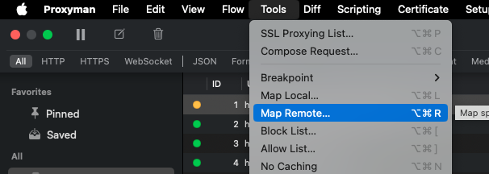
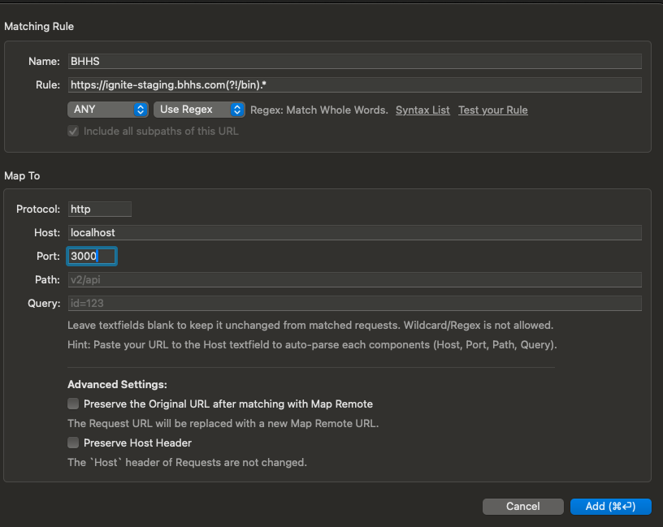

# Your Project's Title...
Your project's description...

## Environments
- Preview: https://main--hsf-commonmoves--hlxsites.hlx.page/
- Live: https://main--hsf-commonmoves--hlxsites.hlx.live/

## Installation

```sh
npm i
```

## Linting

```sh
npm run lint
```

## Local development

1. Create a new repository based on the `aem-boilerplate` template and add a mountpoint in the `fstab.yaml`
1. Add the [AEM Code Sync GitHub App](https://github.com/apps/aem-code-sync) to the repository
1. Install the [AEM CLI](https://github.com/adobe/aem-cli): `npm install -g @adobe/aem-cli`
1. Start AEM Proxy: `aem up` (opens your browser at `http://localhost:3000`)
1. Open the `{repo}` directory in your favorite IDE and start coding :)

## Login on local
Login requests won't work on localhost as login request's response is ignored by browser. So, for local development which needs login funcitonality, below steps need to be followed to make a local proxy.
1. Download and install Proxyman (https://proxyman.io/download)
1. Go to tools > Map Remote

1. 
1. Clear browser cache and hit "ignite-staging.bhhs.com" or the domain configured. It will be proxied to localhost